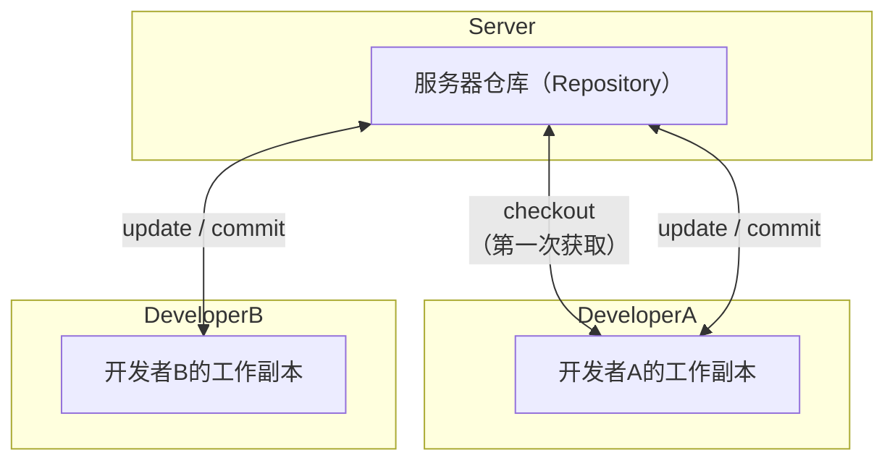

SVN，全称 **Subversion**，是一种**版本控制系统**，用于**管理和跟踪文件的变更**，特别是在多人协作的软件开发中非常常用。

---

### ✅ 简单解释

SVN 就像是给代码或者文件加了一个“时间机器”：

- 你可以保存每次改动的记录（称为“提交”/commit）；
    
- 可以回到过去的某个版本；
    
- 多人协作时，可以看到是谁改了什么；
    
- 防止多人修改时相互覆盖。
    

---

### 📦 SVN 的核心概念

|名称|含义|
|---|---|
|仓库（Repository）|所有版本的数据都存在这里，是中心服务器（和Git的分布式不同）|
|工作副本（Working Copy）|每个开发者从仓库中下载下来的可编辑本地副本|
|提交（Commit）|将修改从本地工作副本上传到服务器仓库中，记录为一个新版本|
|更新（Update）|将服务器上别人的改动同步到自己的本地副本|
|冲突（Conflict）|多人修改同一个文件的同一个部分时，会出现冲突，需要手动解决|

---

### 🔁 SVN 工作流程示意图

---

### ✅ SVN 常用命令/操作

- `svn checkout` —— 从服务器获取项目副本（第一次下载）
    
- `svn update` —— 更新本地副本
    
- `svn commit` —— 提交更改到服务器
    
- `svn add` / `svn delete` —— 添加或删除文件
    
- `svn log` —— 查看提交历史
    
- `svn revert` —— 撤销本地修改
    

---

### 🔍 SVN 与 Git 的区别（简要）

|项目|SVN|Git|
|---|---|---|
|模式|中央式版本控制|分布式版本控制|
|离线操作|受限（不能提交）|完全支持|
|分支操作|相对复杂|非常轻便|
|适合场景|传统企业团队，流程固定的项目|快速开发、开源项目等|

---

如果你想用一句话理解 SVN：

> **“SVN 是一个集中式的版本控制系统，帮助团队管理文件版本、追踪更改并防止冲突。”**

需要我帮你演示一次简单的 SVN 使用流程或配置步骤吗？