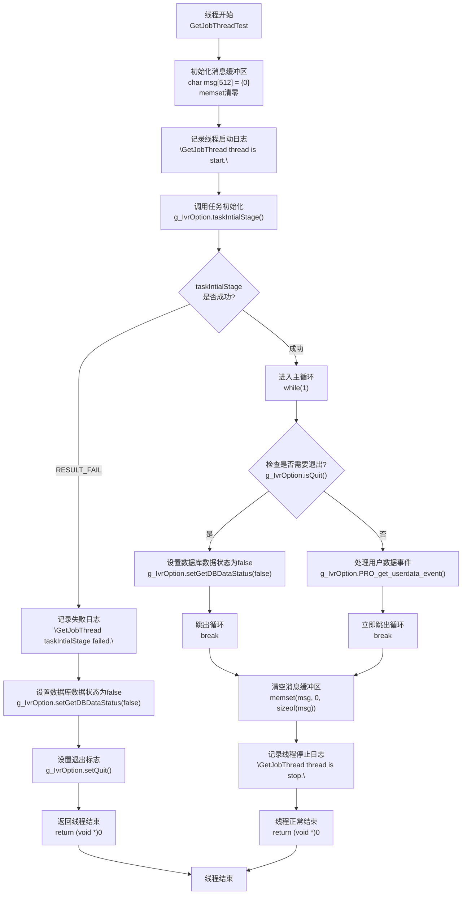
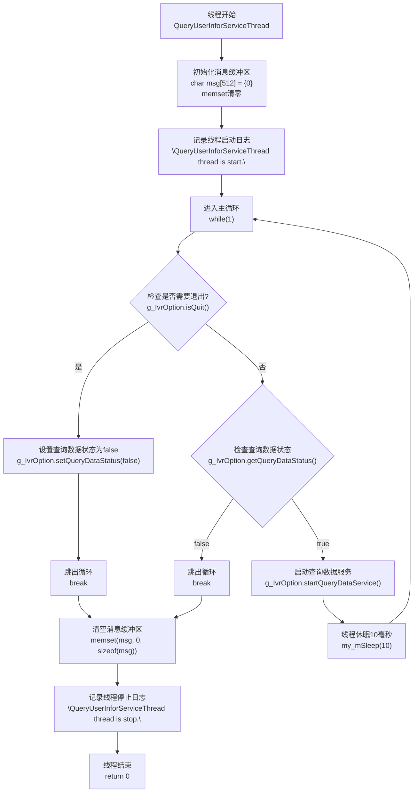
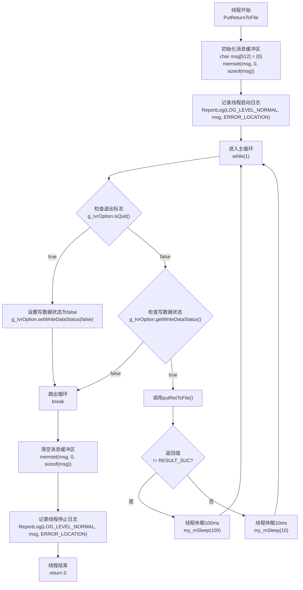
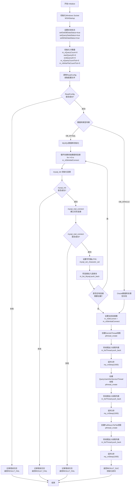

这个脚本有多核优化
无锁编程
并没有断点保存
如果需要交互数据，还是只能有锁编程
DPDK 高速高并发的一个技术
# readme文件

在当前在线用户数据中查询ess平台信息，将推定用户放入到固定的文件夹里。

关键变量：`IS_T
```cpp
void actv_sig_fatal(int sig){
	g_iDesiredState = 1;
	ReportLog(LOG_LEVEL_ERROR, (char*)"Receive exit signal.", ERROR_LOCATION);
}

bool CIvrOption::allComplete(){
	bool bRet = false;
	bRet = !getGetDBDataStatus() && !getQueryDataStatus() && !getWriteDataStatus();
	return bRet;
}

BOOL CIvrOption::Unitialize(){//反初始化
	#ifdef WIN32
	WSACleanup();
	#endif
	m_bExit = true;
	return RESULT_SUC;
}
```
查询方式分为 `0,1,2`三种方式
0 全量查询，只根据IS_TB 是N 查询
1 当月查询 根据IS_TB 是N，TB_TIME 不在本月时间内
2 当日查询 根据IS_TB 是N，TB_TIME 不在当天时间内

接下来是查询表，省略了

Alter Table 附加的命令

最后是关于 `Make file`的东西

# globalfun.h、

头文件extern了对应的 `.cpp`文件里的函数，这样可以作为全局函数使用。这其中包括了：

十六位转换字节数组
字节数组转换为十六位
AES解密
AES加密
`getinfotime`
`getfilename`
`WriteMmlLog`
`WriteResultlLog`
`WriteQueryOutLog`
`ReportLog`

# globalvar.h

头文件extern了全局变量

# IvrMain

## main函数和其相关函数

```cpp
int main(int argc, char *argv[])
{
	get_program_name(argv[0]);
	int nRet = RESULT_SUC;
	int nMode = 0;
	if (argc > 1){
		nMode = atoi(argv[1]);
	}
	g_IvrOption.setMode(nMode);
	nRet = g_IvrOption.Initialize();
	//若初始化失败，直接返回
	if (nRet != RESULT_SUC) {
		return 0;
	}
	signal(SIGINT, SIG_IGN);
	signal(SIGTERM, SIG_IGN);
	signal(SIGINT, actv_sig_fatal);
	signal(SIGTERM, actv_sig_fatal);
	for (; !g_iDesiredState;){
		bool ret= g_IvrOption.allComplete();
		if (ret);
			break;
		}
		my_sleep(5);
	}
	g_IvrOption.Unitialize();  
	return 0;
}
```

```cpp
void actv_sig_fatal(int sig){
    g_iDesiredState = 1;
    ReportLog(LOG_LEVEL_ERROR, (char*)"Receive exit signal.", ERROR_LOCATION);
}

bool CIvrOption::allComplete(){
	bool bRet = false;
	bRet = !getGetDBDataStatus() && !getQueryDataStatus() && !getWriteDataStatus();
	return bRet;
	}

BOOL CIvrOption::Unitialize(){//反初始化
	#ifdef WIN32
	WSACleanup();
	#endif
	m_bExit = true;
	return RESULT_SUC;
	}

BOOL CIvrOption::Initialize()//初始化
{
	#ifdef WIN32
	WORD wVersionRequested;
	WSADATA wsaData;
	wVersionRequested = MAKEWORD(2, 2);
	// can't find socket dll
	WSAStartup(wVersionRequested, &wsaData);
	#endif
	setGetDBDataStatus(true);
	setQueryDataStatus(true);
	setWriteDataStatus(true);
	m_nQueryCount = 0;
	startQueryID = 0;
	endQueryID = 0;
	m_nQueryCountTick = 0;
	m_nWriteFileCountTick = 0;
	int nRet = 0;
	//读取相关配置
	nRet = ReadConfig();
	if (nRet != RESULT_SUC)
	{
		ReportLog(LOG_LEVEL_ERROR, "ReadConfig failed!", ERROR_LOCATION);
		return RESULT_FAIL;
	}	  
	    if (DB_ORACLE == m_DbType)
	    {
	    }
	    else if (DB_MYSQL == m_DbType)
	    {
	        //建立数据库连�?
	        for (int i = 0; i < m_nDbInitialConnect; ++i)
	        {
	            MYSQL* pDB = mysql_init(NULL);
	            if (NULL == pDB)
	            {
	                ReportLog(LOG_LEVEL_ERROR, "mysql_init failed!", ERROR_LOCATION);
	                return RESULT_FAIL;
	            }
	            pDB = mysql_real_connect(pDB,
	                m_MysqlLogInfo.m_strIp.c_str(),
	                m_MysqlLogInfo.m_strLogName.c_str(),
	                m_MysqlLogInfo.m_strLogPassword.c_str(),
	                m_MysqlLogInfo.m_strDb.c_str(),
	                m_MysqlLogInfo.m_nPort,
	                NULL,
	                CLIENT_MULTI_STATEMENTS);
	            if (NULL == pDB)
	            {
	                ReportLog(LOG_LEVEL_ERROR, "mysql_real_connect failed!", ERROR_LOCATION);
	                return RESULT_FAIL;
	            }
	            mysql_set_character_set(pDB, "utf8");
	            m_list_Mysql.push_back(pDB);
	        }
	    }
	    m_nDbCurrent = m_nDbInitialConnect;
	    pthread_t th;
	    //启动任务
	    pthread_create(&th, NULL, GetJobThread, (void *)0);
	    m_listThread.push_back(th);
	    my_mSleep(1000);
	    pthread_create(&th, NULL, QueryUserInforServiceThread, (void *)0);
	    m_listThread.push_back(th);
	    my_mSleep(1000);
	    pthread_create(&th, NULL, PutReturnToFile, (void *)0);
	    m_listThread.push_back(th);
	    my_mSleep(1000);
	    return RESULT_SUC;
	}
```

初始化函数包含了初始化失败的debug信息
先写的debug信息，之后再写的启动任务
启动：创建三个线程，每个线程启动后，延迟一秒确保启动，之后再进行后续任务。
三个线程分别为：

### 1 `extern void* GetJobThreadTest(void *arg)`

在这个函数里，它的功能是*从数据库获取任务数据*。
注意到它调用了 `BOOL CIvrOption::PRO_get_userdata_event()`函数，这个函数才是直接读取数据库内容的。它会对字段进行匹配，然后读取用户对应的字段。
它还使用了 `g_IvrOption.checkSqlDataEnd()`函数来检查数据库是否见底。如果已经遍历完，因为数据库的 `Query ID`的大小是顺序的。则退出。`end`不一定指的是设定好的 `endID`，而是当前程序遍历到的位置的ID。这样做的好处有：

- **断点续传**：程序重启后可以从上次的 `startQueryID`继续处理
- **进度跟踪**：可以随时知道处理进度
- **避免重复处理**：确保每条记录只处理一次
- **优雅退出**：处理完所有数据后自动停止，不会无限循环



### 2 `extern void* QueryUserInforServiceThread(void *arg)`

在这个函数里，它有三个子功能，它的主要功能是*处理用户信息查询*：
	用户信息查询处理 - 执行用户信息的查询服务
	持续服务运行 - 作为后台服务持续运行，每10毫秒执行一次
	状态监控 - 监控系统退出状态和模块状态



### 3 `extern void* PutReturnToFile(void *arg)`

它的功能是将*结果写入文件*。`MySql`有成熟的api来接入这点。它的三个功能是：
	结果文件写入 - 将查询处理后的结果写入文件
	持续监控输出 - 持续检查是否有结果需要写入
	自适应休眠 - 根据写入成功与否调整休眠时间



### 主函数 `int main()`

主函数流程图如下：



最后，`CIvrOption::Unitialize` 是一个成员函数，返回类型为 `BOOL`，用于执行 `CIvrOption` 类的反初始化操作。该函数用于释放资源或重置类的状态以确保正确的清理。

个人认为，分成三个线程这么干，是为了进行多核优化，并发处理。三者有明确的流水线时序，有共同的运行标识符。尽管分别位于三个线程，但是做的确实是同一个事情，且不会因为时许问题而出错。

```mermaid
gantt
    title 三线程流水线处理时序图
    dateFormat X
    axisFormat %s
  
    section GetJobThread
    获取数据1    :0, 100
    获取数据2    :100, 200
    获取数据3    :200, 300
  
    section QueryThread  
    处理数据1    :50, 200
    处理数据2    :150, 300
    处理数据3    :250, 400
  
    section PutReturnToFile
    写入结果1    :150, 250
    写入结果2    :250, 350
    写入结果3    :350, 450
```



相对于游戏，连贯性更强的程序，数据处理中多核优化更容易实现，而且可以更充分的利用计算资源。

# IvrOptions

# IvrOptionsTest

# ai给出的分析（对于整个文件夹）

## 主要源代码文件

IvrMain.cpp - 主程序入口文件，包含主要的业务逻辑
IvrOptions.cpp 和 IvrOptions.h - 配置选项处理模块
globalfun.cpp 和 globalfun.h - 全局函数库，从代码片段可以看到包含：
	MD5 加密函数
	日志写入函数 (WriteResultlLog, WriteQueryOutLog, ReportLog)
	线程函数 (GetJobThread, GetJobThreadTest)
	睡眠函数 (my_mSleep, my_sleep)
	globalvar.h - 全局变量定义头文件

## 测试相关文件

    IvrMainTest.cpp - 主程序的测试文件
	IvrOptionsTest.cpp 和 IvrOptionsTest.h - 配置选项的测试文件
	TestMain.cpp - 测试主程序
	可执行文件和数据
	dg_queryInfo - 主要的可执行程序（二进制文件）
	dg_queryInfoTest - 测试版本的可执行程序
	testmd5 - MD5测试工具

## 编译相关文件

    Makefile - 主程序的编译配置文件
	MakefileTest - 测试程序的编译配置文件
	.o 文件 - 编译生成的目标文件

## 其他文件

    readme.txt - 项目说明文档
	settings.json - Visual Studio Code 配置文件

## 项目性质

从文件名和代码片段来看，这是一个数据库查询信息处理系统（dg_ess_query），主要功能包括：
	查询处理 - 处理数据库查询请求
	日志记录 - 记录操作日志和结果
	多线程处理 - 支持并发查询处理
	配置管理 - 通过IvrOptions管理系统配置
	MD5加密 - 提供数据加密功能
